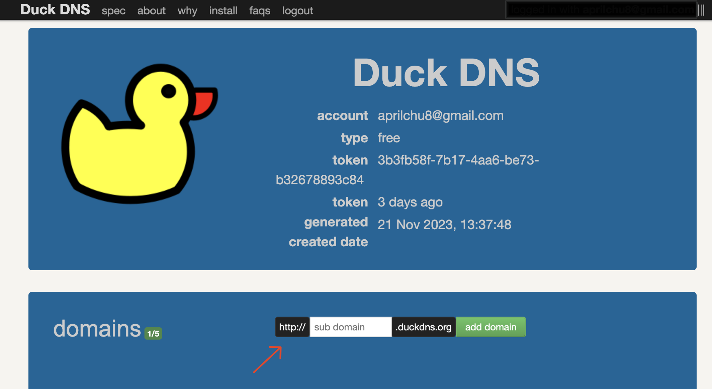

<script>
	import { onMount } from 'svelte';

  let showToc = false; // Initial state, set to true if you want the table of contents to be initially visible

  onMount(() => {
    // Optional: Hide the TOC on page load based on the initial state
    const toc = document.getElementById('toc');
    if (toc) {
      toc.style.display = showToc ? 'block' : 'none';
    }
  });

  function toggleToc() {
    showToc = !showToc;
    const toc = document.getElementById('toc');
    if (toc) {
      toc.style.display = showToc ? 'block' : 'none';
    }
  }
</script>

# How to Build a Handmade Radio: A Manual

⚘ April Chu <br>
𞠕 Last updated on 11.30.2023

---

<section id="toc-container">

<button on:click={toggleToc}>Table of Contents</button>

<div id="toc">

1. [Setting Intentions](#setting-intentions)
2. [Network Overview](#network-overview)
   - [The Network](#the-network)
   - [The Internet Radio Toolchain](#the-internet-radio-toolchain)
3. [Materials](#materials)
4. [Building a Local Radio](#building-a-local-radio)
   - [Set up the Online Radio Toolchain](#set-up-the-online-radio-toolchain)
   - [Optional: Stream VLC to BUTT](#optional-stream-vlc-to-butt)
   - [Optional: Set up SSH](#optional-set-up-ssh)
5. [Configuring the Public Radio](#configuring-the-public-radio)
   - [Set Up Port Forwarding](#set-up-port-forwarding)
   - [Set up Dynamic DNS (DDNS)](#set-up-dynamic-dns)
   - [Update Firewall Settings](#update-firewall-settings)
   - [Optional: Use a Custom Domain](#optional-use-a-custom-domain)
   - [Optional: Set Up SSL](#optional-set-up-ssl)
6. [Glossary](#glossary)

</div>

</section>

<section id="setting-intentions">

## Setting Intentions

> When you liberate programming from the requirement to be professional and scalable, it becomes a different activity altogether, just as cooking at home is really nothing like cooking in a commercial kitchen. I can report to you: not only is this different activity rewarding in almost exactly the same way that cooking for someone you love is rewarding, there’s another feeling, too, specific to this realm....What is this feeling? Independence? Security? Sovereignty?
> <br>
> 𞠕 Robin Sloan, An App Can Be A Home-cooked Meal

This manual is not a technical tutorial to building a reliable and scalable online radio. It is not intended to be an authoritative or exhaustive reference.

Instead, this guide is an invitation to build your own "home-cooked" radio. This manual will walk through how to assemble free and open source software on a Raspberry Pi to stream audio online. It covers the construction of a radio within a local network and offers steps to make it public (if and when you choose to do so). It is for those who have no experience with servers and the command line, for people who have even the slightest interest in building or understanding networks and infrastructure.

This guide aims to serve as a resource to those seeking to participate as collaborators, and not mere consumers, in our increasingly technical world. This guide aligns with notions of liberating technological creation from industrial hands. I hope that the act of creating handmade platforms built by and for us, we can begin to re-enchant our digital realms. Even more so, I hope that you will begin to engage with new feelings of _independence_, _security_, and _sovereignty_.

</section>

---

<section id="network-overview">

## Network Overview

Before we begin building the radio, let's take a step back and look at ① the parts of a network and ② the Internet radio toolchain.

<div id="the-network">

### The Network

A "local network" refers to a network within a scoped geographic area like a home or office. Devices within a local network can communicate directly with each other without the Internet using local IP addresses.

#### Common Terms

**Internet Service Provider (ISP)**: The company that provides your local network with an Internet connection.

**Local Network Devices**: The devices connected to your local network such as computers, smartphones, and IoT (Internet of Things) devices. The Raspberry Pi is a server within the local network, hosting various services like a web and radio server.

**Networking Equipment**

- **Router**: The central device that serves as a gateway that manages traffic between devices in the local network and the Internet. The router assigns local IP addresses to devices on your local network, allowing them to communicate with each other and connect to the Internet.
- **Modem**: A device that connects the local network to the ISP, translating the Internet signal from your ISP into a format the local network can use.

**Network Services**

- **Domain Name System (DNS)**: Translates human-readable domain names into IP addresses, allowing users to access websites using domain names instead of numbers.
- **Dynamic Host Configuration Protocol (DHCP)**: Assigns IP addresses dynamically to devices on the network. This ensures that each device gets a unique IP address so devices can communicate within the local network and access the Internet.
- **Network Address Translation (NAT)**: Allows multiple devices in your home to share a single public IP address provided by the ISP. It replaces the private IP addresses of the devices with the public IP address of your router and keeps track of which device requested what data so that the responses are sent to the correct device.
- **Firewall**: Protects the network by controlling incoming and outgoing traffic based on security rules.

#### How Does Data Flow?

Most of the data that flows in and out of your home is managed automatically by the network devices.

Let's picture a Raspberry Pi connected to your home's local network.

For all outbound traffic from the Pi, like streaming music online, the router assigns a private IP to the Raspberry Pi and uses NAT to replace the private address with the router's public IP. The request is forwarded to the Internet, traveling through the modem to your ISP to the target server. The target server processes the request, generates a response, and sends it back through the same path. Your router uses NAT to direct the response back to the Pi by replacing its public IP with the Pi's private IP.

Inbound traffic, such as accessing a website hosted on the Pi, first reaches the router's public IP address. The router uses NAT to forward the requests to the Raspberry Pi's local IP address and the appropriate port. The Pi processes the request and sends an appropriate response back through the router. The responses traverse the modem and reach the device that initiated the request.

Beyond the automatic processes handled by the networking equipment, there are additional actions needed to secure external access to services hosted on the Pi:

- **Port Forwarding**: The router needs to be configured to allow external requests to be directed to specific ports of the internal IP address of the Pi.
- **Dynamic DNS (DDNS)**: Since the router has a dynamic IP address, a hostname from a DDNS provider needs to be associated with the changing IP address for more reliable service.
- **Firewalls**: Firewalls on both the router the Pi need to be configured to permit incoming connections on the required ports for the specific services.
- **SSL Encryption**: The website hosted on the Pi needs to implement SSL encryption to secure communications.

</div>

<div id="the-internet-radio-toolchain">

### The Internet Radio Toolchain

Online radio is usually composed of three parts:

- **Stream Generator**: The software responsible for creating an audio stream in a specific format, such as MP3 or Ogg Vorbis. It takes input from various sources such as live audio feeds, pre-recorded content, or playlists (ex: BUTT, Liquidsoap, ices, and DarkIce).
- **Streaming Media Server**: The central hub. It is software that relays audio streams to listeners by receiving input from the stream generator and relaying it to listeners (ex: Icecast).
- **Media Player**: The software or application used by listeners to access and play the audio stream (ex: VLC, web browsers).

For this project, Broadcast Using This Tool (BUTT) is the _stream generator_. It captures and encodes audio to send to the Icecast server. Icecast is the _streaming media server_ hosted on the Pi that distributes the stream from the Pi to listeners. Listeners can use the stream's web page as the _media player_ to tune in to the broadcast.

Additionally, we will be using a virtual audio cable to connect output from VLC to BUTT. This will allow us to stream pre-recorded media as well as broadcast live input at the some time.

</div>
</section>

---

<section id="materials">

## Materials

### Hardware

You will need a Raspberry Pi and peripherals to interact with the computer:

- A Raspberry Pi
  - This is your computer and server. I am using a Raspberry Pi 4 Model B. Any Raspberry Pi model with Wi-Fi capabilities will work for this project.
- A keyboard
- A mouse
- A display monitor
- An HDMI to micro HDMI cable
- A 15W USB-C power supply (for the Pi)
  - The official [Raspberry Pi USB-C Power Supply](https://www.raspberrypi.com/products/type-c-power-supply/).
- A Micro SD card with Raspberry Pi OS installed
  - You can buy a pre-loaded SD card along with your Raspberry Pi, or you can install it the Raspberry Pi OS using [Raspberry Pi imager](https://www.raspberrypi.com/software/).

I have not included any audio equipment. For the purposes of testing out your radio, having a computer with a microphone and speakers is sufficient. You can get additional equipment for the Pi if you want to broadcast from the Pi.

### Software

This guide prioritizes open source software. The following software are available to download and use for free:

- [Apache2](https://httpd.apache.org/) (Web Server)
- [Icecast2](https://www.icecast.org/) (Streaming Server)
- [BUTT - Broadcast Using This Tool](https://danielnoethen.de/butt/) (Stream Generator)
- [VLC](https://www.videolan.org/) (Multimedia Player)
- [VB-Cable](https://vb-audio.com/Cable/) (Virtual Audio Cable)

</section>

---

<section id="building-a-local-radio">

## Building a Local Radio

### Set up the Raspberry Pi

The [Raspberry Pi website has great documentation](https://www.raspberrypi.com/documentation/computers/getting-started.html) on how to set up your Pi out of the box. We will mostly be interfacing with the Raspberry Pi through the terminal in this guide.

<blockquote class="note">
	<h4>Common Terminal Commands</h4>
	<ul>
	<li><code>sudo</code>: Stands for "Super User Do." Allows user to execute commands with elevated privileges. 
	<li><code>apt</code>: Stands for "Advanced Package Tool." A package management system install and remove software packages. 
	<li><code>systemctl</code>: Manages services and provides commands to start, stop, restart, enable, disable, and view status.
	<li><code>nano</code>: Opens up a lightweight text editor within the terminal.
	</ul>
</blockquote>

<div id="set-up-the-online-radio-toolchain">

### Set up the Online Radio Toolchain

1. First, install the Apache web server.
   We need to set up a web server to use with Icecast, the streaming media server. This enables us to access Icecast's web-based administration interface and host a webpage.

   - From the terminal, update and upgrade the system
     ```
     sudo apt update
     sudo apt upgrade
     ```
   - Install Apache 2
     ```
     sudo apt install apache2
     ```
   - You might see a prompt to ask if you want to continue. Type `Y` for "Yes" and hit `Enter`
   - Once the installation is complete, you can start the service
     ```
     sudo systemctl start apache2
     ```
   - Make sure Apache start when you turn on the Pi
     ```
     sudo systemctl enable apache2
     ```
   - To test if Apache is installed correctly, open `http://localhost/` on the Pi's browser or enter the Pi's IP address on another computer on the local network. You should see the Apache 2 default welcome page.
     - To find the Pi's IP address:
       ```
       hostname -I
       ```

2. Install Icecast2, the media streaming server.

   - Install Icecast2
     ```
     sudo apt install icecast2 -y
     ```
     - Click `Yes` on the pop-up that asks if you want to configure Icecast. Don't change anything, just hit `Enter`.
   - Let's edit the Icecast2 configuration file to change the default passwords and server name
     ```
     sudo nano /etc/icecast2/icecast.xml
     ```
     - I changed the `Source Password` (used for the source client authentication) and `Admin Password` (used for authenticating admin features of Icecast) for security. You can read the [Icecast Documentation](https://icecast.org/docs/icecast-2.4.1/basic-setup.html) to learn more about basic setup.
   - After updating the configuration file, restart the Icecast2 server and check the status.
     ```
     systemctl restart icecast2
     systemctl status icecast2
     ```
   - Now that we have a web server and Icecast installed, we can access the Icecast stream interface at port 8000 of your Pi. Go to `http://192.168.0.34:8000/` (use the IP address of your Pi) to see the status page of your stream. There will be nothing under "Server Status" because you have not started a stream yet. We have to install BUTT or a stream generator software to begin broadcasting.
      <!-- ![[Screenshot 2023-11-24 at 2.02.18 PM.png|400]] -->
     

3. Download and configure BUTT, the stream generator.

   <blockquote class="note">
   <h4> Download Location </h4>
   <p>You can download BUTT on your Pi or your computer, depending on where you want to stream audio from. I downloaded it on both but remember that if you use your Pi to stream audio you need a mic for audio input and speakers or headphones for output.</p>
   </blockquote>

   - Before installing anything, update and upgrade the system
     ```
     sudo apt-get update
     sudo apt-get upgrade
     ```
   - Choose and download the appropriate source package for your OS from the [BUTT site](https://danielnoethen.de/butt/) and follow the [installation directions on the manual](https://danielnoethen.de/butt/manual.html).
     - On the Pi, you can install BUTT
       - Click on the main menu (the raspberry icon in the top left) and go to `Preferences` > `Add/Remove Software`.
       - A window with the application catalog will show up. Search for `butt`. Check the box next to the highlighted package and click `Apply`. This will install the `butt`.
       - Once installed, if you go the main menu and hover over `Sound & Video` you should see `butt` as an available application.
   - Open BUTT from terminal or by opening the application from the GUI.
     ```
     butt
     ```
   - Go to `Settings` > `Main` > `Server Settings` > `Add` to add a server and link your BUTT broadcast to your Icecast2 stream.
      <!-- ![Screenshot 2023-11-24 at 2.05.43 PM.png] -->

     

     - **Name**: the name of your radio
     - **Address**: `localhost` or the IP address of your Pi
     - **Port**: `8000` is the default from Icecast2 but use the number at `<listen-socket>` in the Icecast2 configuration file
     - **Password**: from `<source-password>`
     - **Icecast mountpoint**: `stream`
     - **Icecast user**: `source`

   - Hit the Play button on BUTT to begin the stream
     - Visit the stream at `http://localhost:8000/stream` or replace `localhost` with the IP address of your Pi
     - If you are not hearing anything on `http://localhost:8000/stream`, make sure you have configured the input device on BUTT. Click on `Settings`, go to the `Audio` tab, and choose a device under `Primary Audio Device`.

<blockquote class="success">
<h4>We're local!</h4>
<p>
We now have a working local radio. Now you should be able to hear your broadcast from <code>http://localhost:8000/stream</code>. The radio can only be accessed from devices connected to the same local network and not available publicly on the Internet. We have to make some configurations so that listeners can stream the broadcast.
</p> 
</blockquote>

</div>

<div id="optional-stream-vlc-to-butt">

### Optional: Stream VLC to BUTT

If you want to stream pre-recorded media, like a playlist, you should connect VLC to BUTT with a virtual audio cable (VAC).

1. Download VLC from the [website](https://www.videolan.org/). Make sure to choose the appropriate package for your operating system.
2. Download VB-Cable VAC from the [website](https://vb-audio.com/Cable/). This is currently only available on Windows and MacOS. For Linux, try [Jack Audio Connection Kit (JACK)](https://jackaudio.org/).

   - Open the VB-Cable application and change `Latency` to `7168 smp`. This will help synchronize the audio from VLC to the Icecast stream so we can hear the media from VLC on the stream.
     <!-- ![[Screenshot 2023-11-25 at 2.31.16 AM.png|400]] -->

   

3. Open VLC and upload some media to the `Playlist`. Go to `Audio` > `Audio Device` and choose `VB-Cable` or the name of the VAC you are using. This will output the media from VLC to the VAC.
4. Open BUTT and go to `Settings` > `Audio` to change the input devices.
   - I chose my `Macbook Microphone` as the `Primary Audio Device` and `VB-Cable` as the `Secondary Audio Device`. This allows me to stream the media from VLC and my microphone input at the same time. You can set `VB-Cable` as the only audio device if you only want to stream from VLC.
5. Verify the media is streaming from VLC
   - Start you broadcast from BUTT and go to the link of your stream at `http://localhost:8000/stream`. You should be able to hear the media from VLC.
   - You can also view the input and output levels on the VB-Cable dashboard. It should be working fine as long as the numbers are constantly changing.
      <!-- ![[Screenshot 2023-11-25 at 2.40.06 AM.png]] -->
     

</div>
<div id="optional-set-up-ssh">

### Optional: Set up SSH

You might find it helpful to set up SSH on your Pi so you can access the computer remotely. SSH lets you control the Pi from your laptop without setting up a monitor.

<blockquote class="note">
<p>
Follow <a href="https://www.howtogeek.com/768053/how-to-ssh-into-your-raspberry-pi/">this guide</a> from Tom's Hardware.
</p>
</blockquote>

1. Make sure you know our username and password for the Pi. To change the default password:
   ```
   passwd
   ```
2. Enable SSH

   - Option 01: Enable SSH through the Pi desktop
     - Go to `Preferences` > `Raspberry Pi Configuration`
     - Go to the `Interfaces` tab and toggle on `SSH`
   - Option 02: Enable SSH from the terminal

     - Open configuration panel from the terminal.

     ```
     sudo raspi-config
     ```

     - Select `Interface Options`
        <!-- ![[Screenshot 2023-11-24 at 1.31.41 PM.png|400]] -->

       

     - Select `SSH`. Then choose `Yes` when asked to enable SSH. Hit `Enter` on the confirmation box.
        <!-- ![[Screenshot 2023-11-24 at 1.32.30 PM.png|400]] -->

       

     - Make sure you select `Finish` at the end

3. Check if SSH is running. If not, start the SSH service.

   ```
   # Check SSH status
   sudo service ssh status

   # Start SSH
   sudo service ssh start
   ```

4. Disable Root Login

   <blockquote class="note">
   <p>
   Disabling direct root login enhances the security of your system by reducing the risk of unauthorized access. It's recommended to log in as a regular user and then use <code>sudo</code> to perform administrative tasks.
   </p>
   </blockquote>

   - In the terminal, open the SSH configuration file.
     ```
     nano /etc/ssh/sshd_config
     ```
     - Find this line in the document: `#PermitRootLogin prohibit-password`
     - Replace the line with: `#PermitRootLogin no`
   - Save the file and restart the SSH server
     ```
     sudo systemctl restart sshd
     ```

5. Now we should be able to login from another computer on the same network!
   - Open the terminal from the other computer and SSH into the Pi
     ```
     ssh username@[address]
     ```
   - Replace the `username` and `address` with your username and Pi's IP address (ex `ssh april@192.168.0.20`).
   - The first time you SSH into your Pi, there will be a prompt that asks you to accept the encryption ket. Accept it.
   - Enter the password to your Pi. It will look like you are not typing anything but your keystrokes are being entered.
   - If successful, you should see something like `username@rpi:~` at the beginning of the line in your terminal.
6. To exit out of SSH use:
   ```
   exit
   ```

</div>
</section>

---

<section id="configuring-the-public-radio">

## Configuring the Public Radio

Once your radio is working locally, we can set up port forwarding and dynamic DNS to make sure your radio is available publicly.

<div id="set-up-port-forwarding">

### Set Up Port Forwarding

If your Raspberry Pi is connected to a router, you'll need to set up port forwarding to forward external traffic to your Raspberry Pi's local IP address. I set up port forwarding on 8000 (for Icecast), port 80 (for HTTP), port 22 (for SSH), and port 443 (for HTTPS).

1. Access your router's settings.
   - Open a web browser and enter your router's IP address in the address bar. The router's IP address is usually `192.168.0.1` or `192.168.1.1`. If you're not sure, check your router's documentation or your ISP. My router had a label on the bottom of the device with the address and settings password.
   - Once you have logged in to the settings page, navigate to the "Port Forwarding" section.
   - Create a new port forwarding rule for each of the four services.

| Service     | Internal IP Address | Internal Port | External Port | Protocol         |
| ----------- | ------------------- | ------------- | ------------- | ---------------- |
| **Icecast** | Pi's Local IP       | 8000          | 8000          | Both (TCP & UDP) |
| **SSH**     | Pi's Local IP       | 22            | 22            | TCP              |
| **HTTP**    | Pi's Local IP       | 80            | 80            | TCP              |
| **HTTPS**   | Pi's Local IP       | 443           | 443           | TCP              |

<blockquote class="note">
<ul>
<li>If your router settings uses port ranges (ex: local start port, local end port, external start port, external end port), just set them all to the same port number.
<li>Port 8000 is the default port for Icecast. If you changed the port number in your Icecast configuration file, use the port that you specified. This should also be the same port you used in your BUTT settings. 
</ul>
</blockquote>

2. To verify that your ports are set up correctly, go to an [online port check tool](https://www.yougetsignal.com/tools/open-ports/).
   - Enter your router's public IP address and the port you forwarded and see if it's connected. You can find your router's public IP address by through an [online IP address checker](https://www.whatismyip.com/).

</div>
<div id="set-up-dynamic-dns">

### Set up Dynamic DNS (DDNS)

The public IP address assigned to your router is often dynamic, meaning it can change periodically due to actions by your Internet Service Provider (ISP) or when you switch networks. By configuring a Dynamic DNS, you can associate a domain name with your router's changing public IP address. This makes it easier to maintain the access to your stream.

I provide steps to register with two free DDNS providers, No-IP and DuckDNS. No-IP requires you to manually confirm that the hostname is in use every 30 days while DuckDNS does not require any verification. I found that I ran into more issues with network security using a DuckDNS hostname which is why I switched over to No-IP.

#### Option 01 - No-ip

<blockquote class="note">
<p> No-IP will send you and email every 30 days to confirm that the hostname is still in use. If you do not confirm the hostname is active, your hostname will be deleted.</p>
</blockquote>

1. Register with No-IP
   - Create an account on the [no-ip website](https://www.noip.com/). The sign-up page will ask you to create a hostname (you can also check the box to create one later). Use any hostname you want.
   - When you are logged in to the dashboard, go to the `Dynamic DNS` tab > `No-IP Hostname`. If you created a hostname, you should be able to see your hostname on the dashboard. If not, create a hostname.
   - Modify the hostname to add your router's public IP address as the `IP/ Target` and make sure the `Hostname Type` is `DNS Hostname A`. This will map your hostname to the public IP address of your router, which forwards traffic to your Pi.
     - You can find your router's public IP address by through an [online IP address checker](https://www.whatismyip.com/).
2. Configure DDNS on the Raspberry Pi

   <blockquote class="note">
   <p>
   Follow <a href="https://www.noip.com/support/knowledgebase/install-linux-3-x-dynamic-update-client-duc#install_from_source">No-IP's official documentation</a>.
   </p>
   </blockquote>

   - SSH into your Pi or open the terminal on the Pi.
   - Download the Linux DUC, the program that will automatically update the DNS records with your router's IP address.
     ```
     wget https://dmej8g5cpdyqd.cloudfront.net/downloads/noip-duc_3.0.0-beta.7.tar.gz
     ```
   - Extract the file
     ```
     tar xf noip-duc_3.0.0-beta.7.tar.gz
     ```
   - Install the DUC
     ```
     cd /home/$USER/noip-duc_3.0.0-beta.7/binaries && sudo apt install ./noip-duc_3.0.0-beta.7_armhf.deb
     ```
   - Once it is installed, run the program
     ```
     noip-duc -g name.ddns.net -u username -p password
     ```
     - Replace `name.ddns.net` with your hostname.
     - Replace `username` and `password` with your email and account password. If your password uses special characters, put it in single quotes (ex: `'!Password'`) to prevent errors.
   - You should see a response with the status about the program. The default behavior of the program is to check the IP of the router every 5 minutes and to update the hostname if the IP changes.

3. Verify DDNS by entering the domain you just set up (ex `http://radio.ddns.net`) into a web browser. You should see the same web page as when you use your router's public IP.

#### Option 02 - Duck DNS

1. Register with Duck DNS

   - Create an account on [Duck DNS](https://www.duckdns.org/)or sign in with an existing account.
   - Once you are logged in, you will see the section to add a domain. Choose a subdomain name and click `Add Domain`.
      <!-- ![[Capture-2023-11-24-175259.png|500]] -->

     

   - You should your router's public IP address automatically filled next the domain name. You can find your router's public IP address by through an [online IP address checker](https://www.whatismyip.com/).

2. Configure DDNS with the Raspberry Pi

   <blockquote class="note">
   <p>
   Follow the <a href="https://www.duckdns.org/install.jsp">Duck DNS official documentation</a>. Choose <code>pi</code> as the operating system.
   </p>
   </blockquote>

   - SSH into your Pi or open the terminal on your Pi. We will be setting up a script to intermittently check the router's IP address and to update DuckDNS with any changes.
   - Make a directory for duckdns, and create the script in the directory.

     ```
     mkdir duckdns
     cd duckdns
     nano duck.sh
     ```

   - In the `duck.sh` document, add the follow line.

     ```
     echo url="https://www.duckdns.org/update?domains=YOUR_DOMAIN&token=YOUR_TOKEN&ip=" | curl -k -o ~/duckdns/duck.log -K -
     ```

     - Replace `YOUR_DOMAIN` with the DuckDNS subdomain associated with your Pi (ex `http://radio.duckdns.org`).
     - Replace `YOUR_TOKEN` with the token provided on your DuckDNS account page.
        <!-- ![[Screenshot 2023-11-24 at 6.10.26 PM.png]] -->

       

     - The API will detect the IP address automatically so there is no need to enter an IP address.

   - Save the file (enter `ctrl + X` to exit and enter `Y` to save).
   - Make the script file executable:
     ```
     chmod 700 duck.sh
     ```
   - Then using cron, we will make the script run every 5 minutes. First, open cron:
     ```
     crontab -e
     ```
     - Paste the following command at the bottom of the document.
       ```
       */5 * * * * ~/duckdns/duck.sh >/dev/null 2>&1
       ```
     - Save the file (enter `ctrl + X` to exit and enter `Y` to save).
   - You can verify the script is running if the following comand returns a prompt.
     ```
     ./duck.sh
     ```
   - You can also check the log to see if the last attempt was successful (returns `OK`).
     ```
     cat duck.log
     ```

3. Verify DDNS by entering the domain you just set up (ex `http://radio.duckdns.org`) into a web browser. You should see the same web page as when you use your router's public IP.

</div>

<div id="update-firewall-settings">

### Update Firewall Settings

A firewall is a security system that enhances the security of the Pi by regulating the flow of traffic between the Pi and local network. We have to update the Pi's firewall rules to allow traffic at specific ports. `iptables` is the command-line utility uses on a Pi to define the rules for network traffic.

1. Check if `iptables` is installed from the terminal

   ```
   sudo iptables --version
   ```

   - If not installed, update packages and install `iptables`
     ```
     sudo apt-get update
     sudo apt-get install iptables
     ```

2. Allow the four ports for which we have set up port forwarding.

   ```
   sudo iptables -A INPUT -p tcp --dport 8000 -j ACCEPT
   sudo iptables -A INPUT -p tcp --dport 80 -j ACCEPT
   sudo iptables -A INPUT -p tcp --dport 443 -j ACCEPT
   sudo iptables -A INPUT -p tcp --dport 22 -j ACCEPT
   ```

3. Save and restart `iptables`

   ```
   sudo service iptables save
   sudo service iptables restart
   ```

4. Check the current firewall rules. The output should list the four ports above.
   ```
   sudo iptables -L
   ```

</div>

<blockquote class="success">
<h4>We're public!</h4>
<p>
From a device outside of the local network that your Pi is connected to, you can access your stream from  <code>http://public-ip:8000/stream</code>  (replace <code>public-ip</code> with your router's Public IP address) or <code>http://radio.ddns.org:8000/stream</code>. Make sure you are streaming from BUTT or there will be an 404 error.
</p>
</blockquote>

<div id="optional-use-a-custom-domain">

### Optional: Use a Custom Domain

A downside with dynamic DNS hostnames is that they often get blocked by enterprise wifi networks (like school and company networks). This means blocked access to the stream.

One workaround is to buy a custom domain and connect the DDNS hostname to the domain. Using a custom domain associated with a DDNS hostname is not guaranteed to work in all situations, as network administrators can employ various methods to control access. Some domain providers like `namecheap.com` offer free DDNS services with domain registration so you don't have to use third-party DDNS services.

1. Purchase a domain on Namecheap
2. Configure Dynamic DNS on the domain in Namecheap

   - [Enable Dynamic DNS](https://www.namecheap.com/support/knowledgebase/article.aspx/595/11/how-do-i-enable-dynamic-dns-for-a-domain/) for the domain
     - For the relevant domain on `Domain List`, click on `Manage` > `Advanced DNS` > Enable the `Dynamic DNS` toggle.
     - Take a note of the `Dynamic DNS Password`. You will need this later when configuring the Pi.
   - Create [A+Dynamic DNS records](https://www.namecheap.com/support/knowledgebase/article.aspx/43/11/how-do-i-set-up-a-host-for-dynamic-dns/). This associates an IP Address with the domain name.

     - Click on `Manage` for the domain. On the `Advanced DNS` tab, go to `Host records`.
     - Click on `Add New Record`.

       - If you want your stream to be accessed at `your-domain.com` and `www.your-domain.com`, add the following records.
         1. Bare domain (`your-domain.com`)
            - **Type**: `A+ Dynamic DNS Record`
            - **Host**: `@`
            - **Value**: `127.0.0.1`\*
         2. www subdomain ( `www.your-domain.com`)
            - **Type**: `A+ Dynamic DNS Record`
            - **Host**: `www`
            - **Value**: `127.0.0.1`\*
       - I have main website deployed on [Vercel](https://vercel.com/home) on my base domain and the stream is only accessible on the subdomain `stream.domain.com`. To set up the record on a subdomain:

         1. Custom subdomain (`stream.your-domain.com`)
            - **Type**: `A+ Dynamic DNS Record`
            - **Host**: `stream`
            - **Value**: `127.0.0.1`\*

       <blockquote class="note">
       <p>
       You can use any IP address for <code>Value</code>. Once the DDNS client is configured, the IP address will be automatically updated. 
       </p>
       </blockquote>

3. [Configure DDNS](https://gist.github.com/PhilMurwin/22ac3674825daa8e22f265178d69c084) on Raspberry Pi

   - Like we did above when we set up DDNS, we have to configure a client to update the A record on Namecheap to correct the public IP address.
   - From the Pi's terminal or via SSH, update packages and install `ddclient`:
     ```
     sudo apt-get update
     sudo apt-get install ddclient
     ```
     - An installation pop-up will open. Feel free to enter dummy answers because we will be changing the configuration file manually.
   - Open the configuration file using `nano`:
     ```
     sudo nano /etc/ddclient.conf
     ```
   - You will see the answers to the installation pop-up. Replace the [file's content](https://www.namecheap.com/support/knowledgebase/article.aspx/583/11/how-do-i-configure-ddclient/):

     ```
     use=web, web=dynamicdns.park-your-domain.com/getip
     protocol=namecheap
     server=dynamicdns.park-your-domain.com
     login=[your-domain.com]
     password=[your namecheap dyndns password]
     [subdomain]
     ```

     - **Login**: replace `[your-domain.com]` with your domain name
     - **Password**: use the password from Namecheap under `Advanced DNS`
     - **Subdomain**: this is the subdomain that you want to update. Use `@` to update the base domain, `www` for `www.domain.com` or `subdomain` for `subdomain.domain.com`.

   - Exit (`CTRL + X`)and save the file (Hit `Y`)
   - Setup the client to run at startup
     ```
     sudo systemctl start ddclient.service
     ```

4. Update Icecast configuration

   - We have to update the Icecast configuration with the new hostname
   - Before making changes, create a backup of the Icecast configuration file

     ```
     # Navigate to configuration file directory
     cd /etc/icecast2/

     # Create a backup of the configuration file
     sudo cp icecast.xml icecast.xml.bak
     ```

   - Open the configuration file using `nano`:
     ```
     sudo nano /etc/icecast2/icecast.xml
     ```
   - Update the `hostname` tag with your domain. If you set it up on your subdomain (`stream.your-domain.com`), then use the subdomain.
     ```
     <hostname>your-domain.com</hostname>
     ```
   - Exit (`CTRL + X`)and save the file (Hit `Y`)
   - Restart Icecast
     ```
     sudo service icecast2 restart
     ```
   - Now if you go to `your-domain.com` or `stream.subdomain.com`, you should see the Icecast status page.

5. Update BUTT
   - We have to update BUTT with the new domain as well
   - Open BUTT and click on `Settings`. On the `Main` tab, go to `Server Settings` and click on `Edit`
   - Update `Address` with your domain (or subdomain). Hit `Save`.
   - Hit play to start streaming. If everything is set up correctly, the BUTT log should say "Connection Established" and you should be able to access your stream at `your-domain.com/stream` or `stream.your-domain.com/stream`.

</div>

<div id="optional-set-up-ssl">

### Optional: Set Up SSL

Now that you have a domain, it's a good idea to set up SSL. When your site has a HTTPS padlock, it enhances security, ensures encryption, and reduces the likelihood of browsers blocking it.

#### Obtain a certificate

1. Install Cerbot, a client for Let's Encrypt and a free Certificate Authority. From the terminal, run:

   ```
   sudo apt-get update
   sudo apt-get install certbot
   ```

2. Obtain an SSL certificate for the domain.

   ```
   sudo certbot certonly --standalone -d your-domain.com
   ```

   - Remember to replace `your-domain.com` with your actual domain.

3. Check the certificate for your domain is listed when you run:
   ```
   sudo certbot certificates
   ```
   - You should see a certificate with your domain name, expiry date, and paths to the certificate and private key.
4. Configure automatic renewal
   - Let's Encrypt certificates usually expire after 90 days. Cerbot will handle the renewal process but we have to schedule a cron job to automatically renew the certificates.
   - Check Certbot can renew the certificate by running the renewal process:
     ```
     sudo certbot renew --dry-run
     ```
   - Open `crontab` to add a job.
     ```
     sudo crontab -e
     ```
   - At the bottom of the document, add this line to check for renewal twice a day (every 12 hours)
     ```
     0 */12 * * * certbot renew
     ```

#### Update icecast

1. Open the Icecast configuration file:
   ```
   sudo nano /etc/icecast2/icecast.xml
   ```
2. At the bottom of the file, add your SSL certificate details
   ```
   <!-- Enable SSL -->
   <ssl>1</ssl>
   <ssl-certificate>/etc/letsencrypt/live/[your-domain.com]/fullchain.pem<ssl-certificate>
   <ssl-private-key>/etc/letsencrypt/live/[your-domain.com]/privkey.pem<ssl-private-key>
   <port>443</port>
   ```
   - Replace `[your-domain.com]` for both the `<ssl-certificate>` and `<ssl-private-key>` with the your actual domain.
3. Exit (`CTRL + X`) and save the changes (`Y`)
4. Restart Icecast to apply the changes:
   ```
   sudo service icecast2 restart
   ```
5. You can check your SSL with an [online SSL tester](https://www.ssllabs.com/ssltest/).

</div>
</section>

---

<section id="glossary">

## Glossary

[Apache](https://apache.org/)

- A foundational, open-source web server software for deploying websites and web applications.

[Broadcast Using This Tool (BUTT)](https://danielnoethen.de/butt/)

- A free, open-source software application to broadcast live audio streams over the Internet.

[Certbot](https://certbot.eff.org/)

- An open-source command-line tool that simplifies the process of obtaining and renewing SSL/TLS certificates. It is the recommended client for Let's Encrypt, helping to automate the certificate issuance and renewal process.

Domain Name System (DNS)

- Translates human-readable domain names into IP addresses, allowing users to access websites using domain names instead of numbers.

Dynamic DNS (DDNS)

- A service that automatically updates the DNS whenever the public IP address of a device changes. This allows users to access their devices or services using a hostname (e.x. radio.ddns.org) rather than relying on a changing and potentially unknown IP address.

Dynamic Host Configuration Protocol (DHCP)

- Assigns IP addresses dynamically to devices on the network. This ensures that each device gets a unique IP address so devices can communicate within the local network and access the Internet.

[Let's Encrypt](https://letsencrypt.org/)

- A nonprofit certificate authority (CA) that provides free SSL/TLS certificates for websites to enable HTTPS.

[Icecast](https://www.icecast.org/)

- A free, open-source software to set up and run a streaming media server on the Internet.

Internet Service Provider (ISP)

- A company that provides users with Internet access by deploying and maintain the necessary infrastructure to deliver Internet services.

IP Address

- An Internet Protocol address a numerical address that uniquely identifies a device on a network, helping them find and communicate with each other. Public IP addresses are assigned by ISPs and are unique globally on the Internet. Private IP addresses are used within local networks and cannot be accesible from the public Internet.

Modem

- A device that connects the local network to the ISP, translating the Internet signal from your ISP into a format the local network can use.

Network Address Translation (NAT)

- Allows multiple devices in your home to share a single public IP address provided by the ISP. It replaces the private IP addresses of the devices with the public IP address and keeps track of which device requested what data so that the responses are sent to the correct device.

Ports

- A communication endpoint (picture a numbered door) on a device that is used for network communication. Ports are a numerical value ranging from 0 to 65535 that identifies a unique process or service on a device within a network. Certain ports are reserved for certain processes like port 80 for web browsing or port 22 for SSH.

Radio Server

- A server equipped with specialized software that enables the broadcasting or streaming of media files.
- The radio server in this project is comprised of Icecast2 (software) that distributes audio files and the Raspberry Pi (hardware) that hosts and runs the streaming application.

Raspberry Pi

- A single-board computer (SBC) that operates in the open source ecosystem. It runs Linux and its main supported operating system, Pi OX, is open source and runs a suite of open source software.

Router

- The central device that serves as a gateway that manages traffic between devices in the local network and the Internet. The router assigns local IP addresses to devices on your local network, allowing them to communicate with each other and connect to the Internet.

Secure Shell (SSH)

- A cryptographic network protocol to securely connect to and control another computer over the internet, usually used to secure remote access to servers. It keeps communication private and ensures connection to the right computer.

Secure Sockets Layer (SSL)

- A cryptographic protocol that ensures information exchanged between a user's web browser and a web server is secure and private. SSL encrypts the data during transmission to prevent the tampering of data in online communication.
- When websites use HTTPS (instead of HTTP), it means they are a more secure version to encrypt the data exchanged between the user's web browser and the web server.

Server

- Servers are usually high-powered computers built to store, process, and manage network data, devices, and systems. However, any computer with the necessary software can function as a server.
- Servers are both the software that handles a specific task (like web servers) and the hardware (computers that handle the software) that supports the software.

Web Server

- A software application or hardware device that stores, processes, and delivers web content to users over the Internet. It handles tasks such as processing HTTP requests to access a web pages or dynamically generates content based on the request.
- The web server in this project uses Apache2 (software) to handle web-related tasks which is hosted and run on the Raspberry Pi (hardware).

Virtual Audio Cable (VAC)

- Software that allows you to route audio signals between different applications or devices on your computer virtually.

</section>
